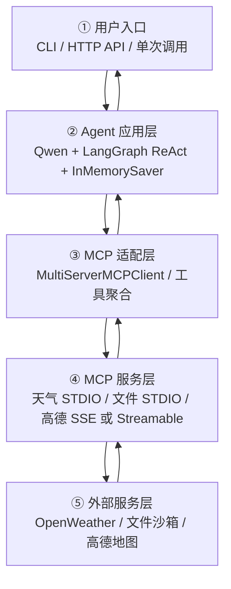
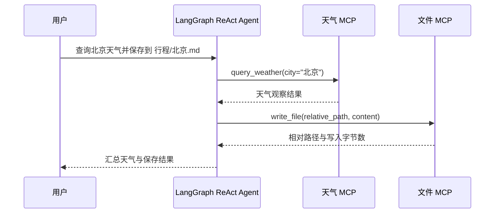

# RouteMate MCP 智能出行助手

RouteMate 是一个面向 Agent 入门实践的智能出行项目：使用 **LangGraph ReAct** 组织“思考 → 调用工具 → 观察 → 回复”循环，通过 **MCP** 把天气查询、安全文件写入和可选地图服务接入同一个 Agent。项目提供交互式 CLI、FastAPI HTTP API 与单次命令三种入口。

本仓库刻意保留了应届生项目合适的边界：实现一条完整、可运行、可测试的工具调用链路，但不宣称已经具备生产级鉴权、持久化记忆、监控或性能指标。

## 功能概览

- `MultiServerMCPClient` 聚合多台 MCP Server 的工具，Agent 侧不依赖具体服务实现。
- 两台本地 STDIO 服务：OpenWeather 天气查询、安全文本写入。
- 可选高德地图远程服务配置，同时给出 SSE 与 streamable HTTP 两种模板，默认均禁用。
- Qwen（DashScope）+ LangGraph `create_react_agent` 完成在线 ReAct 循环。
- `InMemorySaver` 按 `thread_id` 保存在线会话上下文，支持同一进程内的多轮对话。
- 无任何密钥时自动进入确定性离线演示，测试和基础体验不依赖外网。
- 文件工具只允许写入指定沙箱，拒绝绝对路径、目录穿越、危险文件类型和超限内容。
- 内置无需 Node 构建的 Web 对话工作台：快捷提问、会话 thread、工具调用轨迹和运行状态均可视化。

## 五层架构



各层职责如下：

1. 用户入口只负责输入、参数校验和结果展示。
2. Agent 应用层判断任务、选择工具，并由 `thread_id` 关联同一进程中的对话状态。
3. MCP 适配层读取服务配置，将多台 Server 的工具合并为统一列表。
4. MCP 服务层把普通 Python 能力包装成标准工具；新增服务不需要改动 Agent 主流程。
5. 外部服务层是真正的数据或操作边界，密钥只从环境变量注入。

## ReAct 工作流程

下面以“查询北京天气并保存到文件”为例。一次任务可能触发多轮工具调用，而不是只调用一个函数：



在线模式使用模型决定下一步动作；离线模式用确定性规则复现“天气 → 写文件”这条纵向链路，方便无密钥运行和回归测试。离线天气始终带有 `offline_demo` / “固定演示数据”标识，不会冒充实时数据。

## 项目结构

```text
routemate-mcp/
├─ src/routemate/
│  ├─ agent.py                 # 离线/在线统一 Agent 门面
│  ├─ offline.py               # 确定性离线流程
│  ├─ api.py                   # FastAPI 入口
│  ├─ cli.py                   # 交互式入口
│  ├─ once.py                  # 单次调用入口
│  ├─ mcp_config.py            # 多服务配置、环境变量替换与校验
│  ├─ sandbox.py               # 文件路径沙箱与原子写入
│  ├─ weather.py               # OpenWeather / 演示数据适配
│  └─ mcp_servers/
│     ├─ weather_server.py     # 天气 STDIO MCP Server
│     └─ file_server.py        # 文件 STDIO MCP Server
├─ src/routemate/static/       # 零构建 Web 对话工作台
├─ run_demo.ps1                # Windows 一键启动离线页面
├─ tests/                      # 配置、沙箱、Agent、API 测试
├─ servers_config.example.json # 本地及可选远程 MCP 模板
├─ .env.example
├─ pyproject.toml
└─ requirements.txt
```

## 快速开始：无密钥离线演示

推荐 Python 3.10～3.12。

```powershell
python -m venv .venv
.\.venv\Scripts\Activate.ps1
python -m pip install -U pip
pip install -e ".[dev]"
Copy-Item .env.example .env
```

`.env.example` 默认是 `ROUTEMATE_MODE=auto`。当 `DASHSCOPE_API_KEY` 为空时，系统会自动使用离线模式。

单次调用：

```powershell
routemate-once "查询北京天气并保存到 行程/北京天气.md"
```

交互式 CLI（相同 `thread_id` 可先查询、下一轮再保存）：

```powershell
routemate --thread-id demo-user
```

```text
你> 查询上海天气
你> 保存到 行程/上海天气.md
你> /exit
```

HTTP API：

```powershell
routemate-api
```

浏览器工作台：

```text
http://127.0.0.1:8000/
```

打开页面后可以直接点击快捷指令，体验“查询天气”“天气结果保存为行程文件”和离线路线演示；天气结果会明确标注为固定演示数据。页面也提供 `/docs` 链接查看完整 API。

另开终端调用：

```powershell
$body = @{
  message = "查询杭州天气"
  thread_id = "web-demo"
} | ConvertTo-Json

Invoke-RestMethod `
  -Method Post `
  -Uri "http://127.0.0.1:8000/v1/chat" `
  -ContentType "application/json" `
  -Body $body
```

可用端点：

- `GET /health`：返回服务状态和当前模式，不返回任何密钥。
- `GET /`：本地 Web 对话工作台。
- `GET /meta`：返回当前模式、工具和传输方式。
- `POST /v1/chat`：接收 `message` 与 `thread_id`，返回回答及本轮工具轨迹。
- `GET /docs`：FastAPI 自动生成的交互文档。

## 在线 Agent 配置

先在本地 `.env` 中设置真实值；不要修改并提交 `.env.example`：

```dotenv
ROUTEMATE_MODE=online
DASHSCOPE_API_KEY=你的_DashScope_Key
QWEN_MODEL=qwen-plus
OPENWEATHER_API_KEY=你的_OpenWeather_Key
ROUTEMATE_OUTPUT_DIR=./runtime_output
```

不设置 `MCP_SERVERS_CONFIG` 时，应用会自动构造两台本地 STDIO Server 的配置。在线启动过程为：

1. `MultiServerMCPClient` 启动天气与文件 Server 并发现工具；
2. `ChatTongyi` 连接 Qwen；
3. 工具列表注入 LangGraph ReAct Agent；
4. `InMemorySaver` 使用请求中的 `thread_id` 区分会话；
5. 模型按需要调用一个或多个工具，并基于观察结果生成最终回复。

`InMemorySaver` 只保存当前进程内的上下文，服务重启后不会保留。这是当前项目的明确边界，不应当把它描述为持久化长期记忆。

## 可选高德地图 MCP

复制示例配置后再修改，仓库不会携带服务地址或 token：

```powershell
Copy-Item servers_config.example.json servers_config.local.json
```

然后：

1. 在 `servers_config.local.json` 中将 `amap_sse` 或 `amap_streamable` 的一个 `enabled` 改为 `true`；
2. 在 `.env` 填写对应的 `AMAP_MCP_SSE_URL` 或 `AMAP_MCP_STREAMABLE_URL`；示例保留了 Bearer 请求头，服务要求令牌时填写 `AMAP_MCP_TOKEN`，无需令牌时应从本地配置删除 `headers` 字段；
3. 设置 `MCP_SERVERS_CONFIG=./servers_config.local.json`；
4. 保持另一种高德传输为禁用，避免重复注册同类工具。

远程服务字段会在启动时校验。`optional: true` 表示缺少相关环境变量时跳过该可选服务；启用且非可选的服务若缺少配置，应用会直接报告错误。

> 不同高德 MCP 服务提供方的 URL、鉴权头和工具名可能不同，应以该服务的实际说明为准。本项目只提供 MCP 客户端接入位，不伪造远程服务实现或路线数据。

## 文件沙箱

`write_file` 的安全边界位于 MCP Server 内部，不依赖模型是否遵守提示词：

- 只接收相对路径，目标必须位于 `ROUTEMATE_OUTPUT_DIR` 下；
- 拒绝 `..`、绝对路径、盘符、控制字符和 Windows 保留文件名；
- 只允许 `.txt`、`.md`、`.json`；
- 单次内容上限为 100 KiB；
- 在目标目录内先写临时文件，再使用原子替换完成落盘。

默认生成目录 `runtime_output/` 已加入 `.gitignore`。

## 独立运行 MCP Server

通常由 `MultiServerMCPClient` 自动拉起；调试时也可以单独启动：

```powershell
routemate-weather-mcp
routemate-file-mcp --output-dir .\runtime_output
```

两者使用 STDIO 传输，标准输入输出属于 MCP 协议通道，不适合作为普通交互式命令使用。

## 新增工具

以新增“车次查询”为例：

1. 在 `src/routemate/mcp_servers/` 新建模块；
2. 使用 `FastMCP` 创建服务，并通过 `@mcp.tool` 暴露参数清晰、返回值可序列化的函数；
3. 将启动命令写入本地 MCP 配置，选择 `stdio`；远程服务则选择实际支持的 `sse` 或 `streamable_http`；
4. 为输入校验、失败分支和工具结果增加测试；
5. 在线启动后，`MultiServerMCPClient` 会聚合新工具，通常无需改动 Agent 调度代码。

工具函数应自行落实权限和输入边界，不能把模型提示词当作安全控制。

## 测试

```powershell
python -m pytest
```

当前测试覆盖：环境配置与密钥脱敏、离线天气确定性、同线程两步任务、跨线程隔离、MCP 配置筛选、HTTP 接口，以及文件沙箱的正常与拒绝路径。

## 当前边界

- 在线模式需要有效的 DashScope 密钥；实时天气需要 OpenWeather 密钥。
- 高德地图仅提供可选接入配置，未包含第三方服务、密钥或路线结果。
- 会话记忆是 `InMemorySaver`，没有 Redis/Postgres 持久化。
- 未实现登录鉴权、租户隔离、限流、监控告警或生产部署编排。
- 离线规则只覆盖天气查询、保存最近天气结果和地图未连接提示，不等价于大模型推理。

## 可用于简历的真实表述

- 基于 LangGraph ReAct 与 `MultiServerMCPClient` 搭建智能出行 Agent，将天气查询、安全文件写入等能力封装为独立 FastMCP 服务，实现工具发现与多步调用。
- 使用 `InMemorySaver + thread_id` 管理进程内多轮上下文，并提供 CLI、FastAPI、单次命令三种调用入口。
- 设计无密钥确定性演示路径，使天气查询到文件保存的核心流程可离线运行和自动化回归。
- 为文件 MCP 增加目录边界、扩展名、内容大小及原子写入约束，并用 pytest 覆盖正常流程、路径穿越和会话隔离。

## License

[MIT](LICENSE)
